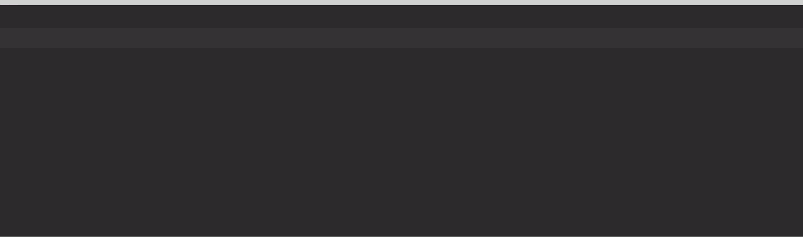

# Quickly Find Folders

Alfred workflow to Quickly Find Folders by partial match. Powered by the standard Find utility.

# Usage
First, configure the workflow and set a folder to start searches from (could be your home folder).

Then...
Use the keyword "qff" followed by a partial folder name to start searching.
Select a folder and press enter to "drill down" and start a search from here.
Or select a folder and press command+enter to reveal in Finder.

The default maxdepth for searches is 3, to keep searching snappy. 
Folders prefixed with a dot (e.g. .git), vendor, node_modules and ~/Library are ignored by default.

# Requirements

This workflow requires JQ on your system.

- Use Homebrew to install jq with: brew install jq
- Use MacPorts to install jq with: port install jq
- Use Fink to install jq with: fink install jq
